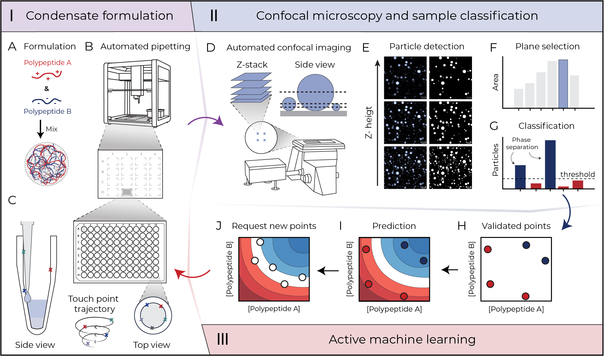

[](https://doi.org/10.26434/chemrxiv-2024-frnj3)
<!-- [](https:///zenodo.org/records/8289605) -->

<!-- Title-->
<h1 id="Title">Automated navigation of condensate phase behavior with active machine learning</h1>

**Y.H.A Leurs**<sup>1</sup>, **W. van den Hout**<sup>1</sup>, **A. Gardin**<sup>1</sup>, **J.L.J. van Dongen**, **Andoni Rodriguez-Abetxuko**, **Nadia A. Erkamp** **J.C.M. van Hest**<sup>\*</sup> **Francesca Grisoni**<sup>\*</sup>, **L. Brunsveld**<sup>\*</sup>\
<sup>1</sup>These authors contributed equally to this work.\
<sup>\*</sup>Corresponding authors: j.c.m.v.hest@tue.nl, f.grisoni@tue.nl, l.brunsveld@tue.nl.

<!-- Abstract-->
<h2 id="abstract">Abstract</h2>
Biomolecular condensates are essential functional cellular structures that form through phase separation of macromolecules such as proteins and RNA. Synthetic condensates have recently gathered great interest as they can be engineered to better understand the formation mechanism of these cellular condensates and serve as cell-mimetic platforms to develop novel therapeutic strategies. The complexity of the biomolecular components and their reciprocal interactions, however, makes precise engineering and systematic characterization of condensate formation a challenging endeavor. While constructing phase diagrams is a systematic approach to gain comprehensive insight into phase separation behavior, it is a time-consuming and labor-intensive process. Here, we present an automated platform for efficiently mapping multi-dimensional phase diagrams of condensates. The automated platform incorporates a pipetting system for sample formulation, and an autonomous confocal microscope for particle property analysis and characterization. Active machine learning – which allows iterative model improvement – is used to learn from previous experiments and steer future experiments towards an efficient exploration of the binodal. The versatility of the pipeline is demonstrated by showcasing its ability to rapidly explore the phase behavior of various polypeptides of opposite charge across formulations, producing detailed and reproducible multidimensional phase diagrams. Beyond identifying phase boundaries, the platform also quantificaties key condensate properties such as particle size, count, and volume fraction – adding functional insights to phase diagrams. This self-driven platform is robust and generalizable, providing key insights into condensate formation and characteristics.



<!-- Content-->
<h2 id="content">Content</h2>

This repository contains the code used to apply the active machine learning pipeline described in the main [paper](https://doi.org/10.26434/chemrxiv-2024-frnj3) and depiceted in the Figure above, section III, panel H, I, J.\
This repository is structured in the following way:
-   `experiments/` : folder containing the experiments completed by our platform and some test cases.
-   `figures/` : folder containig high resolution figure as reported in the main paper.
-   `robotexperiments/` : main folder containig the `.py` files defining the package.
-   `script/` : folder containig scripts for setting up (`experiments/`) and running (`cycles/`) the experiments, and for plotting results (`plots/`).
-   `environment.yml` : the environment file to isntall the package.
-   `setup.py` : the file for installing the package.

<h2 id="installation">Installation</h2>
Install dependencies from the provided env.yaml file. This typically takes a couple of minutes (tested on Ubuntu 22.04.3).

```bash
conda env create -f env.yaml
```

The installation requires another custom python package, stated in the `environment.yml` file and available at this link, [ActiveLearningCLassiFier](https://github.com/AGardinon/ActiveLearningCLassiFier).

<h2 id="cite">How to cite</h2>
You can currently cite our preprint:

Automated navigation of condensate phase behavior with active machine learning.\
_Yannick Leurs, Willem van den Hout, Andrea Gardin, Joost van Dongen, Andoni Rodriguez-Abetxuko, Nadia A. Erkamp, Jan van Hest, Francesca Grisoni, Luc Brunsveld_\
ChemRxiv, 04 December, 2024.
DOI: https://doi.org/10.26434/chemrxiv-2024-frnj3
